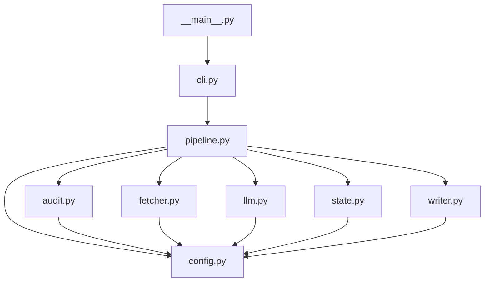
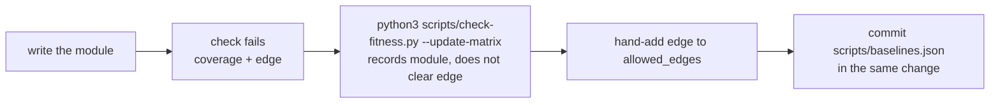

# Fitness Functions

Mechanical, CI-gated checks that enforce the `kb_pipeline/` architecture against versioned baselines. Run on every build via `scripts/check-fitness.py`; baselines live in `scripts/baselines.json`.

## What this adds (diff vs main)

- `scripts/check-fitness.py` — the checker: a dependency matrix, a module-set coverage guard, and per-module size baselines.
- `scripts/baselines.json` — versioned baseline data the checks compare the code against.
- `.github/workflows/ci.yml` — a `Fitness functions` step (before lint) that runs the checker with no flags.
- `docs/agents/compliance.md` — enforcement matrix updated so architectural #1/#3 and design #6 are now CI + Review.
- `docs/adr/0007-architectural-vs-design-rules.md` — ADR updated to name `check-fitness.py` as the second mechanical enforcement vehicle.
- `tests/test_fitness.py` — unit tests for all three guards and both update flags.

## How it works

```mermaid
flowchart TD
    CI[.github/workflows/ci.yml<br/>Fitness functions step] -->|python3 scripts/check-fitness.py| RUN
    RUN[check-fitness.py run] --> LOAD[load scripts/baselines.json]
    LOAD --> GUARDS{three guards}
    GUARDS -->|no flags| EDGES[dependency matrix<br/>allowed_edges]
    GUARDS -->|no flags| COVERAGE[module coverage<br/>modules]
    GUARDS -->|no flags| SIZE[size limits<br/>size_limits +10%]
    EDGES --> VIOLATIONS[collect violations]
    COVERAGE --> VIOLATIONS
    SIZE --> VIOLATIONS
    VIOLATIONS -->|any| FAIL[print fitness: messages<br/>exit 1 = build fails]
    VIOLATIONS -->|none| PASS[exit 0]
    RUN -.--|human only, never CI| UM[--update-matrix<br/>re-seeds modules]
    RUN -.--|human only, never CI| UB[--update-baseline<br/>re-seeds size_limits]
    UM -.-> LOAD
    UB -.-> LOAD
```

CI never passes `--update-matrix` or `--update-baseline`; they exist for a developer to refresh a baseline locally after a deliberate change.

## The allowed dependency graph

`collect_edges` scans every top-level `from .x import ...` in `kb_pipeline/*.py` and requires each edge to appear in `allowed_edges` — a full allow-list, so any unlisted edge fails.



Edit this diagram whenever you edit `allowed_edges` in `scripts/baselines.json`.

## The three guards

- **Dependency matrix** (`allowed_edges`) — any intra-package edge not in the allow-list fails. Direction only: it never asserts that an allowed edge is *used*, and cohesion / minimum public surface stay on the Review axis.
- **Module coverage** (`modules`) — the set of `*.py` modules minus `__init__.py` must equal `modules`. A new, renamed, or deleted module fails.
- **Size limits** (`size_limits`) — a module's line count may not exceed its baseline × 1.1.

## Updating baselines

Neither update flag touches `allowed_edges`, so a run after a forbidden edge can never auto-approve it. A legitimate new edge is a hand-edited entry, reviewed in the PR diff.

New module workflow:



To re-seed size limits after a deliberate refactor: `python3 scripts/check-fitness.py --update-baseline`, then commit `scripts/baselines.json`.

## Troubleshooting

| CI message | Cause | Fix |
| --- | --- | --- |
| `fitness: forbidden edge: <a> -> <b>` | `a` imports `b`; edge not in `allowed_edges` | Hand-add `[a, b]` to `allowed_edges` in `scripts/baselines.json` (and update the graph above) |
| `fitness: module \`<m>\` not in coverage set` | `kb_pipeline/m.py` exists; not in `modules` | Run `--update-matrix`, or add `m` to `modules` |
| `fitness: module \`<m>\` in matrix but missing from package` | `modules` lists a module that no longer exists | Run `--update-matrix`, or remove `m` from `modules` |
| `fitness: <m>.py size regression: <n> lines exceeds baseline <b> x 1.1` | Module grew past baseline + 10% | Refactor, or run `--update-baseline` after a deliberate size increase |
