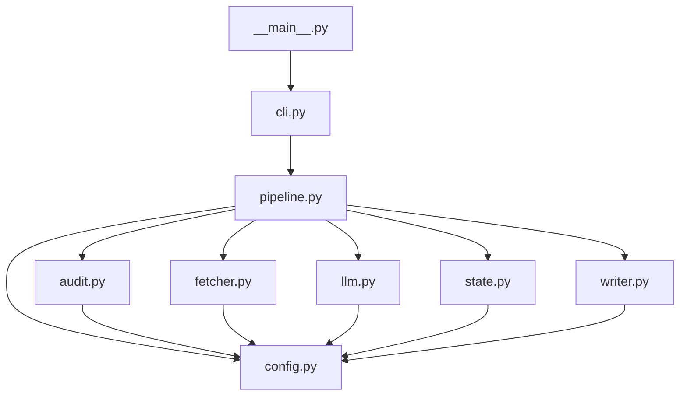
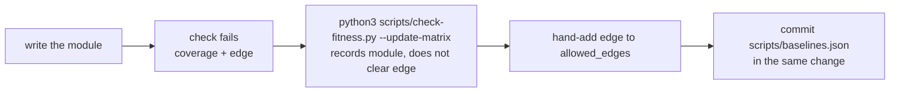

# Fitness Functions

Fitness functions are automated checks. CI runs them on every build. They compare the `kb_pipeline/` code against versioned baselines. The baselines are in `scripts/baselines.json`. The checker is `scripts/check-fitness.py`.

## What this adds (diff vs main)

- `scripts/check-fitness.py` — this is the checker. It has a dependency matrix, a module coverage guard, and size baselines.
- `scripts/baselines.json` — this is the versioned baseline data. The checks compare the code against it.
- `.github/workflows/ci.yml` — CI has a `Fitness functions` step. It runs the checker with no flags. It runs before the lint step.
- `docs/agents/compliance.md` — the compliance document now shows architectural rules #1/#3 and design rule #6 as CI + Review.
- `docs/adr/0007-architectural-vs-design-rules.md` — the ADR names `check-fitness.py` as the second mechanical enforcement tool.
- `tests/test_fitness.py` — these are the unit tests. They cover the three guards and both update flags.

## How it works

```mermaid
flowchart TD
    CI[.github/workflows/ci.yml<br/>Fitness functions step] -->|python3 scripts/check-fitness.py| RUN
    RUN[check-fitness.py run] --> LOAD[load scripts/baselines.json]
    LOAD --> GUARDS{three guards}
    GUARDS -->|no flags| EDGES[dependency matrix<br/>allowed_edges]
    GUARDS -->|no flags| COVERAGE[module coverage<br/>modules]
    GUARDS -->|no flags| SIZE[size limits<br/>size_limits +10%]
    EDGES --> VIOLATIONS[collect violations]
    COVERAGE --> VIOLATIONS
    SIZE --> VIOLATIONS
    VIOLATIONS -->|any| FAIL[print fitness: messages<br/>exit 1 = build fails]
    VIOLATIONS -->|none| PASS[exit 0]
    RUN -.--|human only, never CI| UM[--update-matrix<br/>re-seeds modules]
    RUN -.--|human only, never CI| UB[--update-baseline<br/>re-seeds size_limits]
    UM -.-> LOAD
    UB -.-> LOAD
```

CI never passes `--update-matrix` or `--update-baseline`. A developer uses them to refresh a baseline after a deliberate change.

## The allowed dependency graph

`collect_edges` scans every top-level `from .x import ...` statement in `kb_pipeline/*.py`. Each edge must appear in `allowed_edges`. This is a full allow-list. Any unlisted edge fails.



Change this diagram whenever you change `allowed_edges` in `scripts/baselines.json`.

## The three guards

- **Dependency matrix** (`allowed_edges`) — any intra-package edge not in the allow-list fails. It checks direction only. It does not check whether an allowed edge is in use. Cohesion and minimum public surface stay on the Review axis.
- **Module coverage** (`modules`) — the set of `*.py` modules, minus `__init__.py`, must equal `modules`. A new module, a renamed module, or a removed module fails.
- **Size limits** (`size_limits`) — a module's line count may not exceed its baseline × 1.1.

## Updating baselines

Neither update flag changes `allowed_edges`. A run can never approve a forbidden edge. A valid new edge is a hand-edited entry. It is reviewed in the PR diff.

New module workflow:



To set the size limits to the current line counts, run `python3 scripts/check-fitness.py --update-baseline`. Then commit `scripts/baselines.json`.

## Troubleshooting

| CI message | Cause | Fix |
| --- | --- | --- |
| `fitness: forbidden edge: <a> -> <b>` | `a` imports `b`. The edge is not in `allowed_edges`. | Add `[a, b]` to `allowed_edges` in `scripts/baselines.json`. Change the graph above too. |
| `fitness: module \`<m>\` not in coverage set` | `kb_pipeline/m.py` exists. It is not in `modules`. | Run `--update-matrix`, or add `m` to `modules`. |
| `fitness: module \`<m>\` in matrix but missing from package` | `modules` lists a module. That module no longer exists. | Run `--update-matrix`, or remove `m` from `modules`. |
| `fitness: <m>.py size regression: <n> lines exceeds baseline <b> x 1.1` | The module grew past its baseline plus 10%. | Refactor the module, or run `--update-baseline` after a deliberate size increase. |
